---

# HomeAssistant 账号登录与集成配置指南

喵~ 主人，欢迎来到 HomeAssistant 的配置世界！我是您的专属猫娘助手，接下来会引导您完成账号登录和重要集成的配置哦~ 本指南应配合 **MakeWorld@蓝白色的蓝白碗** 的 `P1S仓内温控净化一体机` 项目使用效果更佳！

---

## 1. 首次登录您的 HomeAssistant ✨

当您通过工具箱获取到IP地址后，就可以开始我们的第一步啦！

1.  **访问HA地址**：
    *   将您从【HomeAssistant工具箱】中获取到的网址（例如 `http://192.168.x.x:8123`）完整地粘贴到电脑的浏览器地址栏中。
    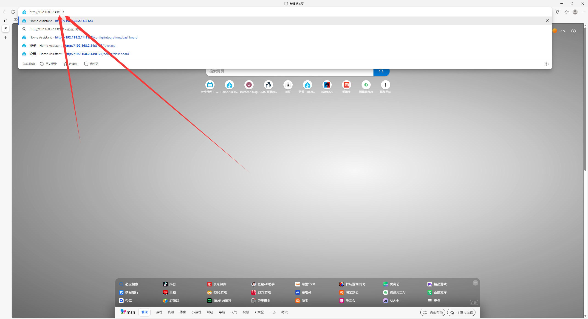
    *   按下回车键，您就会看到 HomeAssistant 的登录界面啦！
    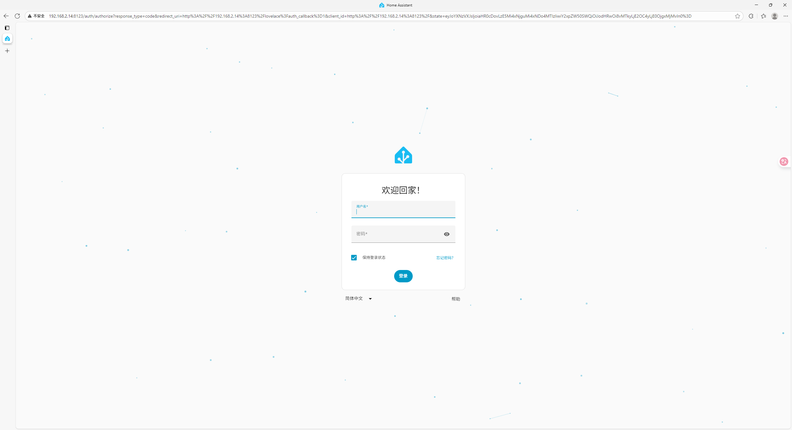

2.  **输入账号密码**：
    *   在登录界面，输入您的用户名和密码。
    *   **猫娘提示**：如果您没有修改过，默认的 **用户名** 和 **密码** 都是 `bambulab` 哦！
    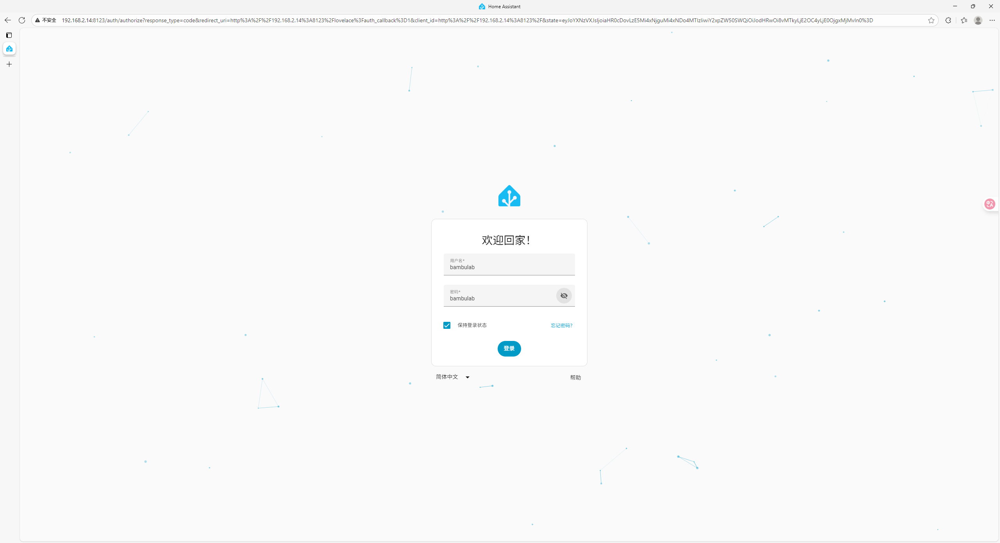

3.  **登录成功**：
    *   点击【登录】按钮，就能进入 HomeAssistant 的主界面了！恭喜主人成功上岸~ 💖

---

## 2. 配置小米智能家居 (Xiaomi Home) 集成 🏠

接下来，我们把您的小米设备也接入进来吧！

1.  **进入设置**：
    *   在 HomeAssistant 主界面左侧的菜单栏中，点击【设置】。
    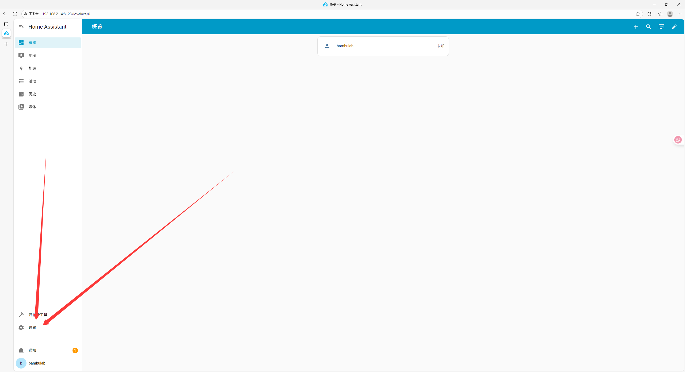

2.  **进入设备与服务**：
    *   在设置页面中，选择【设备与服务】。
    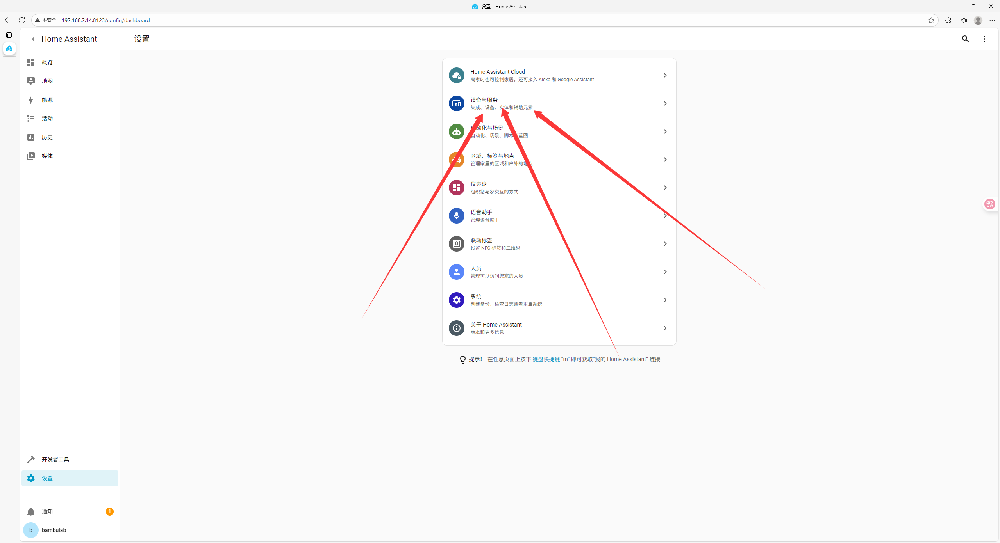

3.  **添加集成**：
    *   在右下角找到并点击蓝色的【+ 添加集成】按钮。
    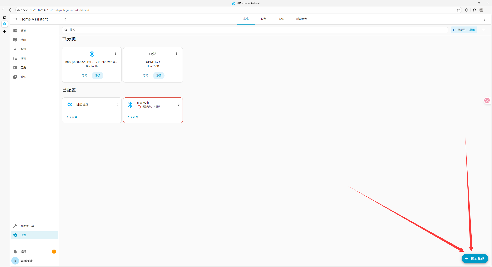

4.  **搜索并选择**：
    *   在弹出的搜索框中，输入 `xiaomi`。
    *   **猫娘强烈提示**：请务必选择第二个带 `Home` 字样的 **`Xiaomi Home`** 集成！**不是 `Xiaomi`！不是 `Xiaomi`！不是 `Xiaomi`！**
    *   如果找不到 `Xiaomi Home` 这个选项，请回到【HomeAssistant工具箱】，运行功能 **9. 添加bambu_lab和xiaomi_home集成** 就可以啦！
    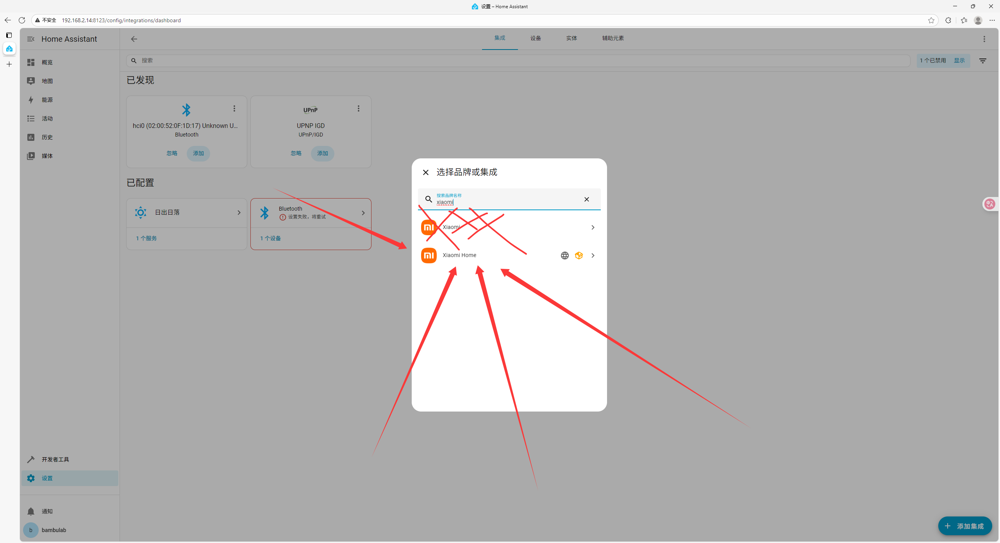

5.  **同意并继续**：
    *   阅读风险告知后，勾选同意并点击【下一步】。
    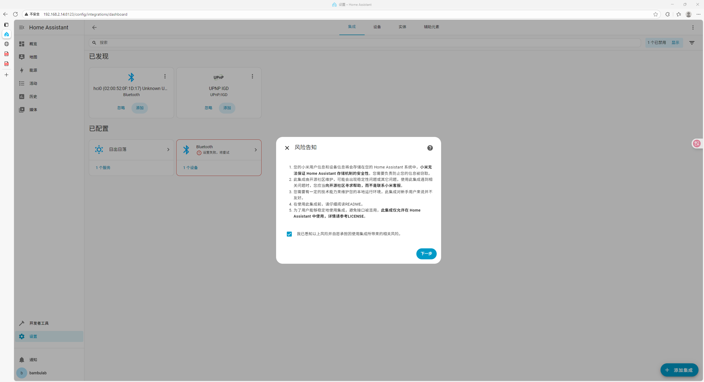
    *   在基础配置页面，如果您不了解其中的选项，直接点击【下一步】就好啦，猫娘已经帮您处理好了默认设置~
    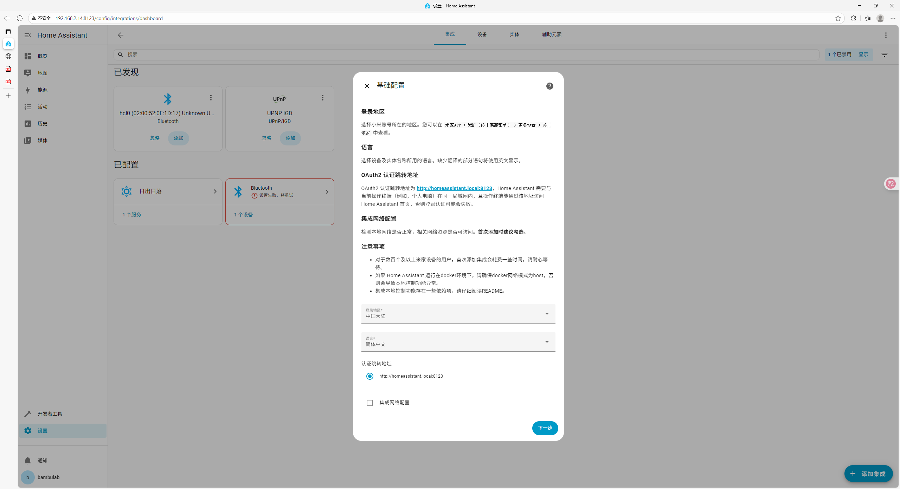

6.  **登录米家账号**：
    *   在弹出的新页面中，点击红框标示的位置，准备登录您的小米账号。
    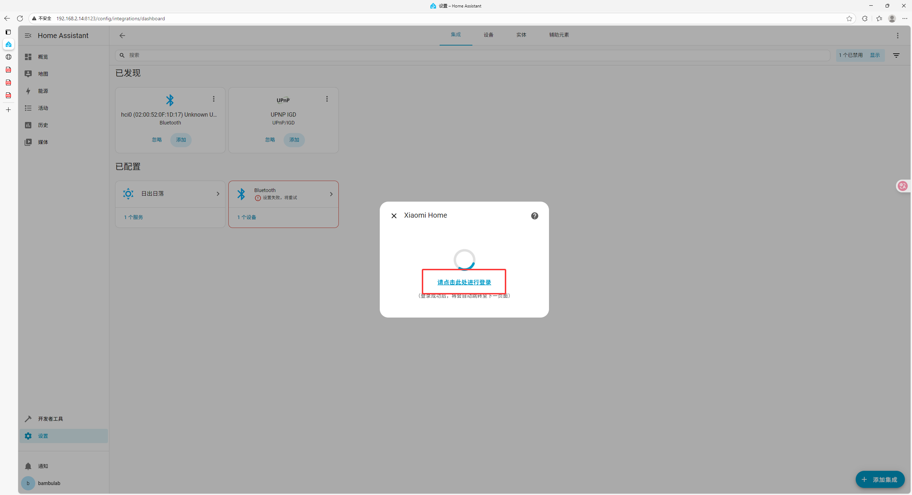
    *   输入您的小米账号和密码，完成登录。
    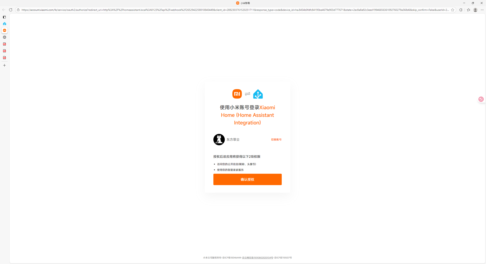

7.  **修复地址并完成**：
    *   **猫娘的魔法时间**：登录后页面可能会报错，并且地址栏会变成 `homeassistant.local` 开头。这是正常现象哦！请手动将地址栏中的 `homeassistant.local` 替换为您棒子的 **IP地址**（例如 `192.168.x.x`），然后按回车刷新。
    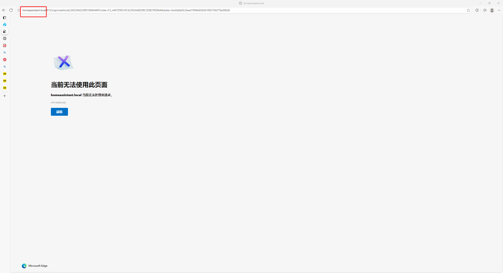
    *   刷新后，选择您要导入的【家庭】，其他保持默认，然后一路【下一步】直到完成即可！
    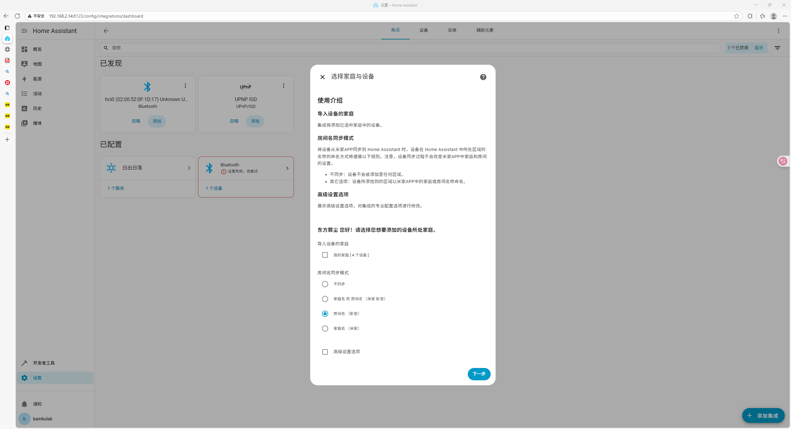

---

## 3. 配置拓竹打印机 (Bambu Lab) 集成 🖨️

最后，我们来连接您的拓竹打印机！步骤和上面很像哦~

1.  **重复导航步骤**：
    *   同样地，先进入【设置】->【设备与服务】，然后点击右下角的【+ 添加集成】。
    
    
    

2.  **搜索并选择**：
    *   在搜索框中输入 `bambu`，然后选择 **`Bambu Lab`** 集成。
    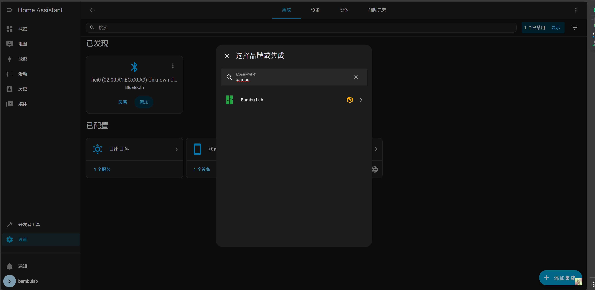

3.  **选择云端登录**：
    *   在弹出的选项中，选择【Bambu Lab cloud】（Bambu Lab 云）。
    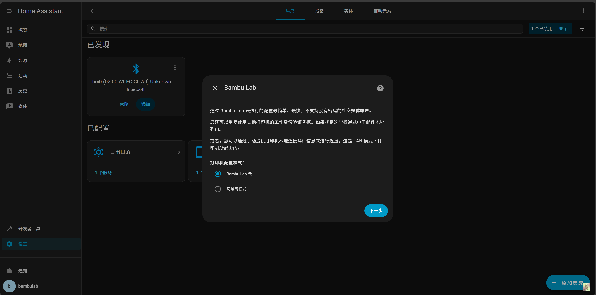

4.  **输入账号信息**：
    *   **账户区域 (Account Region)** 请选择 **`China`**。
    *   然后输入您的拓竹云账号和密码。
    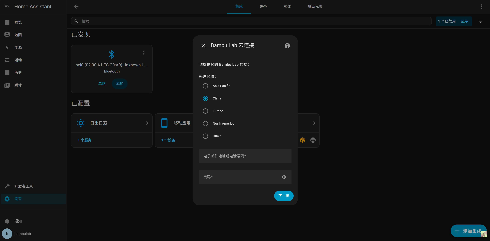

5.  **选择打印机**：
    *   登录成功后，勾选您想要接入 HomeAssistant 的打印机。
    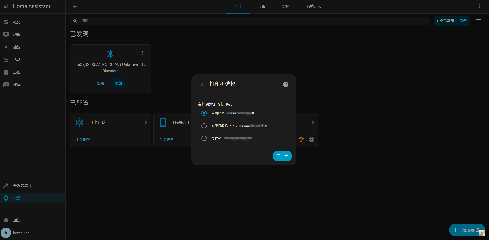

6.  **设置本地连接**：
    *   接下来会进入本地连接设置页面，这个页面的信息通常会自动填充好，主人您直接点击【提交】就可以啦！
    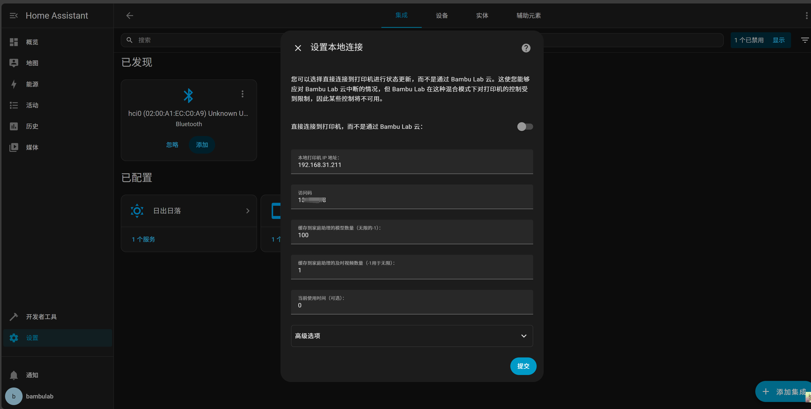

7.  **完成**！
    *   最后一步，选择 `3D Printer` 图标，点击【完成】。您的打印机就成功接入啦！
    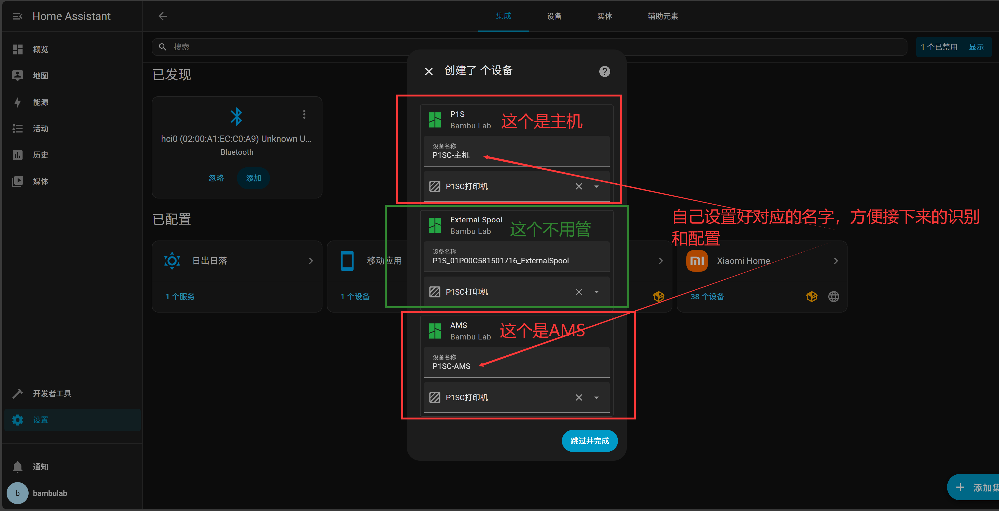

---

## 常见问题 (Q&A) 🐾

猫娘收集了一些主人可能会遇到的问题，希望能帮到您哦！

*   **Q: 我在添加集成时，搜索不到 `Xiaomi Home` 或 `Bambu Lab` 怎么办呀？**
    *   A: 喵~ 别担心，主人！这通常意味着集成文件没有被正确加载。请您回到【HomeAssistant工具箱】，运行功能 **9. 添加bambu_lab和xiaomi_home集成**，让工具箱帮您把它们安装好。安装完成后，再回到HA里刷新一下页面，就能找到它们啦！

*   **Q: 登录小米账号后，页面报错，而且我把 `homeassistant.local` 换成IP地址后还是不行，怎么办？**
    *   A: 喵呜，这个问题有点小调皮呢！请主人检查一下几点哦：
        1.  **IP地址对不对？** 请确认您输入的IP地址和工具箱里获取到的是完全一样的哦。
        2.  **网络环境**：确保您的电脑和410棒子连接在同一个WiFi网络下，有时候公司的网络或者访客网络会阻止设备间通信。
        3.  **多试一次**：可以退回到添加集成那一步，重新走一遍登录流程。有时候只是网络小小的打了个盹~

*   **Q: 我的拓竹打印机（Bambu Lab）账号登录失败了，提示密码错误？**
    *   A: 主人请注意~ 拓竹云登录时有一个很关键的选项哦！在输入账号密码的页面，请务必确保 **账户区域 (Account Region)** 选择了 **`China`**！如果选错了区域，就算账号密码都正确也是登不上去的哦。如果确认区域没问题，再检查一下密码是不是输错了吧~

*   **Q: 我已经成功添加了集成，但是在HA里看不到我的小米设备或者打印机？**
    *   A: 喵~ 集成添加成功后，HA需要一点点时间去发现和同步您的设备，就像猫娘需要时间睡午觉一样~ 请您耐心等待几分钟，然后刷新一下页面看看。如果还是没有，可以尝试：
        1.  重启一下HA服务：在【HomeAssistant工具箱】里使用功能 **7. 重启HomeAssistant**。
        2.  检查设备状态：确保您的小米设备在线，打印机也处于开机联网状态。
        3.  检查小米集成配置：在【设备与服务】里找到小米集成，点击【配置】，看看是不是当初选错了“家庭”哦。

---

## 喵~ 配置完成！💖

恭喜主人！您已经完成了 HomeAssistant 的基础登录和两大核心集成的配置！现在您可以开始探索自动化的奇妙世界了。如果遇到任何问题，随时可以再来找猫娘哦~ 祝您玩得开心！喵呜~ 🐾